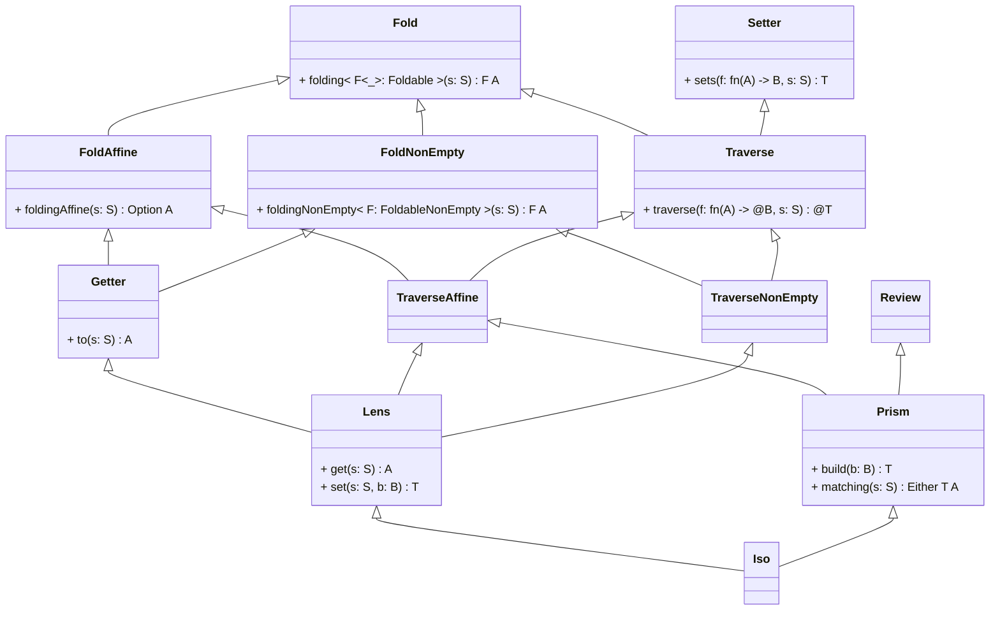

Одна из главных проблем при работе с иммутабельными данными – это обновление структур, особенно если они глубоко вложены. Для решения этой проблемы используются оптики.

В случае языка Flow я хочу сделать оптики first-class citizen.

Простой случай обновления структуры (только линзы):
```rust
struct Person {
  name: String,
  age: i32,
  address: Address,
}

struct Address {
  street: String,
  city: String,
  state: String,
  zip: String,
}

fn main() -> @[IO] () {
  let person = Person {
    name = "John",
    age = 30,
    address = Address {
      street = "123 Main St",
      city = "Anytown",
      state = "CA",
      zip = "12345",
    },
  };

  let newPerson = person.set(#address/#street, "456 Main St");

  println!("New person: {:?}", newPerson);
}
```

Случай с использованием линзы + призмы:

```rust
struct Person {
  name: String,
  age: i32,
  address: Option<Address>,
}

struct Address {
  street: String,
  city: String,
  state: String,
  zip: String,
}

fn main() -> @[IO] () {
  let person = Person {
    name = "John",
    age = 30,
    address = Some(Address {
      street = "123 Main St",
      city = "Anytown",
      state = "CA",
      zip = "12345",
    }),
  };

  let newPerson = person.set(#address/#Some/#street, "456 Main St");

  println!("New person: {:?}", newPerson);
  let newOtherPerson = person
    .updated(#address/#Some/#city, |city| city ++ " City");
  println!("New other person: {:?}", newOtherPerson);
}
```

Иерархия оптик:

